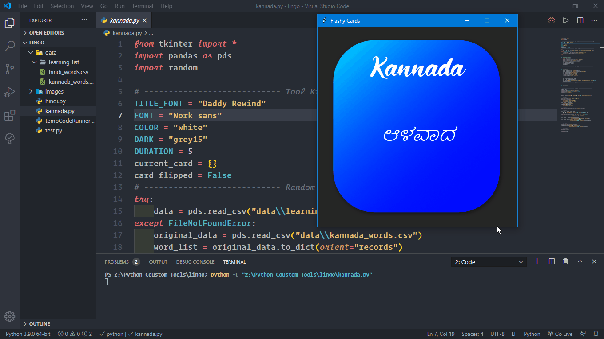
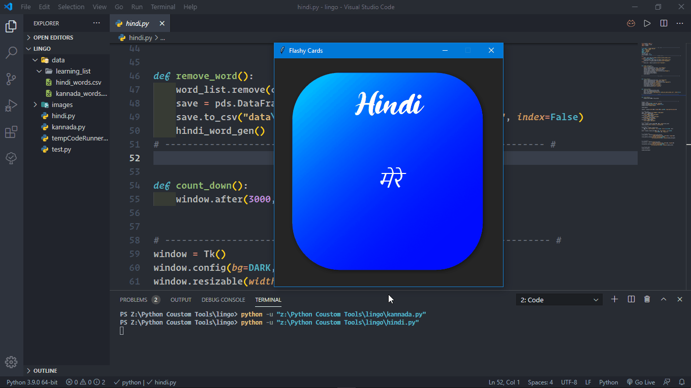

# Lingo-Learn-the-language
Lingo - is a simple python Gui Program, that helps you learn the most frequent words in a language. So that it would be easier to frame sentences.

! Currently Hindi & Kannada languages are included.
# The program has been included with 500 freuqent words that are commonly used
## NOTE: These frequent words are from movie subtitles and other sources.

# Kannada Language Demo:

# Hindi Language Demo:

# Please Subscribe and Share:
Link: https://www.youtube.com/channel/UCMJ5uaHN9srQcijCHQfW9MQ

# Thanks a lot
